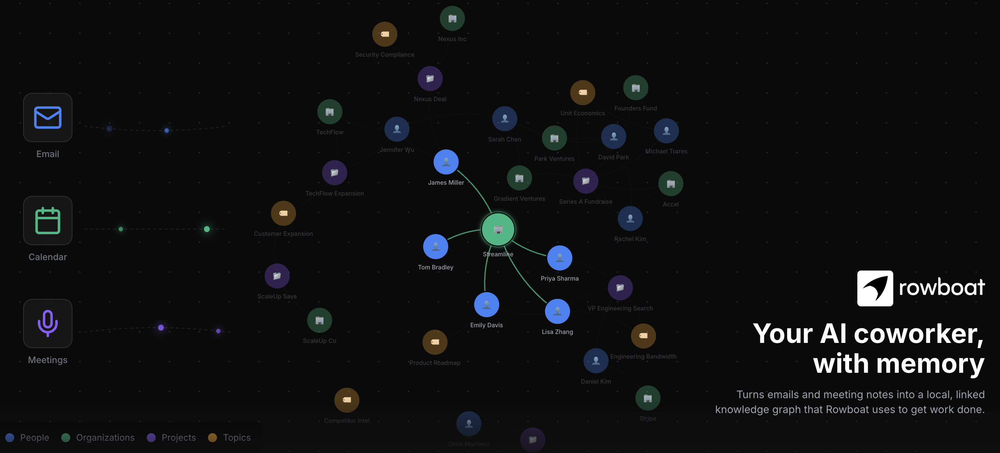
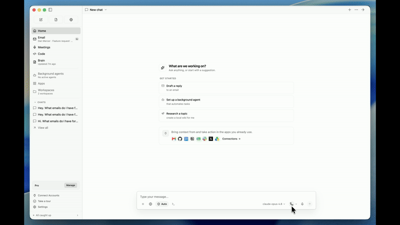
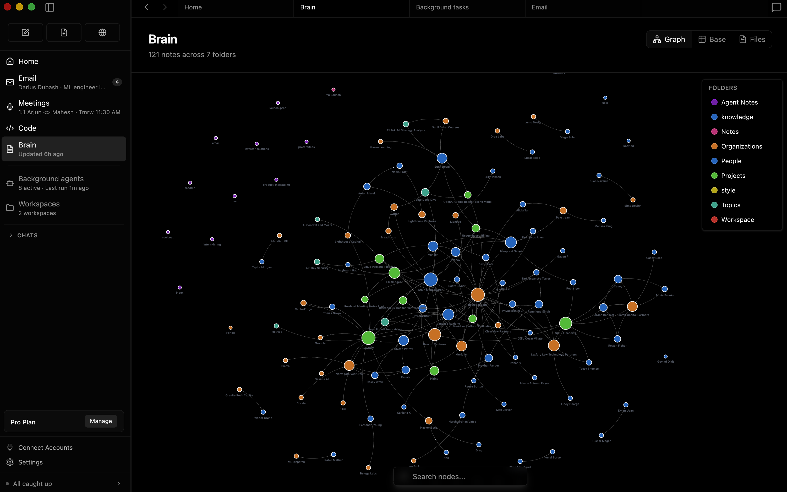
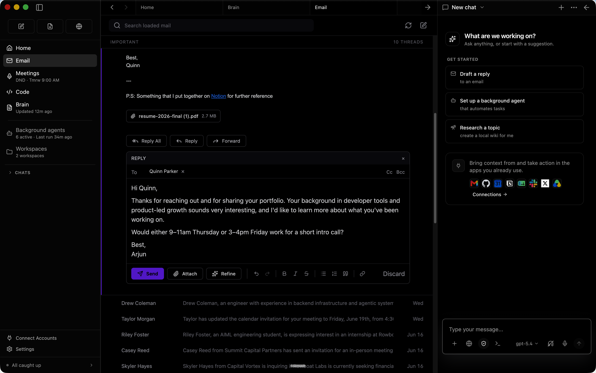
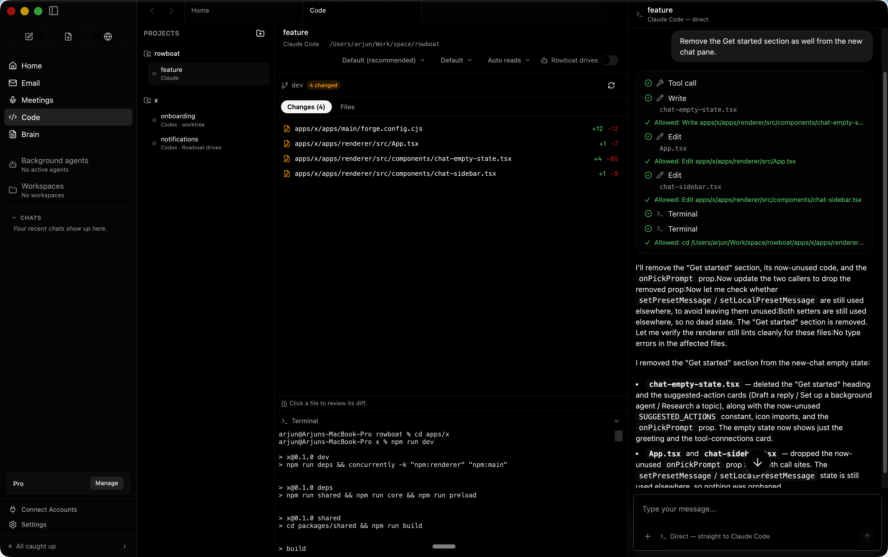
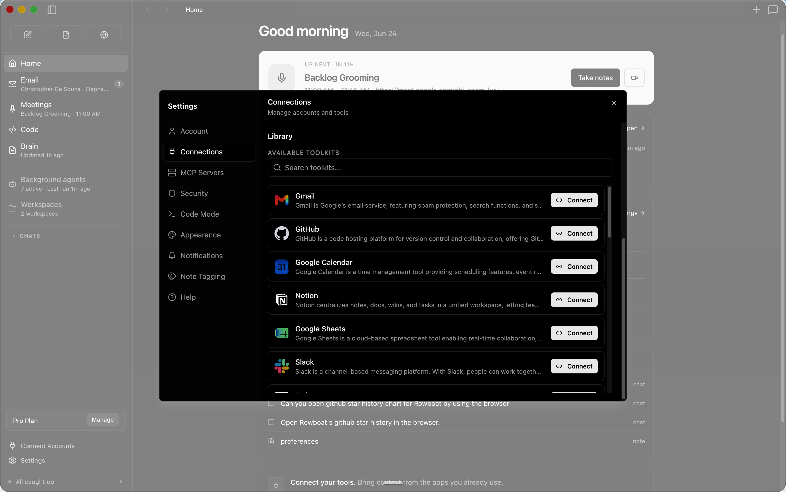

<p align="center">
  <a href="../../README.md">English</a> · <a href="README.zh-CN.md">简体中文</a> · <a href="README.ja.md">日本語</a> · <a href="README.ko.md">한국어</a> · <a href="README.es.md">Español</a> · Français · <a href="README.pt.md">Português</a>
</p>

<a href="https://www.youtube.com/watch?v=5AWoGo-L16I" target="_blank" rel="noopener noreferrer">
  
</a>

<h5 align="center">

<h1 align="center">Rowboat</h1>
<p align="center">Un coéquipier IA de bureau doté d'une mémoire de votre travail et de surfaces intégrées pour agir dessus.</p>

<p align="center" style="display: flex; justify-content: center; gap: 20px; align-items: center;">
  <a href="https://trendshift.io/repositories/13609" target="blank">
    
  </a>
</p>

<p align="center">
    <a href="https://www.rowboatlabs.com/" target="_blank" rel="noopener">
    
  </a>
  <a href="https://discord.gg/wajrgmJQ6b" target="_blank" rel="noopener">
    
  </a>
  <a href="https://x.com/intent/user?screen_name=rowboatlabshq" target="_blank" rel="noopener">
    
  </a>
  <a href="https://www.ycombinator.com" target="_blank" rel="noopener">
    
  </a>
</p>

</h5>

Rowboat indexe votre travail dans un graphe de connaissances vivant et s'en sert pour accomplir des tâches sur votre machine. Il comprend des surfaces de travail pour collaborer avec l'IA : client e-mail, notes, navigateur, mode code, preneur de notes de réunion et espaces de travail pour différents projets.


Télécharger la dernière version pour Mac/Windows/Linux : [Télécharger](https://www.rowboatlabs.com/downloads)

<p align="center">
<a href="https://www.youtube.com/watch?v=et5yQABJ3xI">

</a>
</p>

<p align="center">
  <a href="https://www.youtube.com/watch?v=et5yQABJ3xI"> Démo - des apps au code </a> · <a href="https://www.youtube.com/watch?v=7xTpciZCfpw"> Démo - graphe de connaissances</a>
</p>


⭐ Si vous trouvez Rowboat utile, merci de mettre une étoile au dépôt. Cela aide davantage de personnes à le découvrir.

---
## Aperçu

<table>
<tr>
<td width="40%" valign="middle">
<h3>Cerveau</h3>
Rowboat indexe les e-mails, les réunions, Slack et les conversations avec l'assistant dans un graphe de connaissances vivant à liens croisés, à la manière d'Obsidian.
</td>
<td width="60%">

</td>
</tr>
<tr>
<td width="40%" valign="middle">
<h3>E-mail</h3>
Le client e-mail intégré trie les messages entre les importants et tout le reste. Rowboat rédige automatiquement des brouillons de réponse pour les e-mails importants en s'appuyant sur tout le contexte de travail.
</td>
<td width="60%">

</td>
</tr>
<tr>
<td width="40%" valign="middle">
<h3>Agents en arrière-plan</h3>
Vous pouvez configurer des agents en arrière-plan qui se déclenchent sur des événements, comme l'arrivée d'un nouvel e-mail, ou selon un calendrier, par exemple tous les jours à 8 h. Ils peuvent se connecter à des outils, effectuer des recherches sur le web, utiliser le navigateur et écrire du code avec Claude Code ou Codex.
</td>
<td width="60%">


</td>
</tr>
<tr>
<td width="40%" valign="middle">
<h3>Navigateur intégré</h3>
Rowboat inclut un navigateur qui vous permet, à vous et à l'assistant, de collaborer sur des tâches web. Comme il est isolé de votre navigateur principal, vous pouvez ne vous connecter qu'aux comptes auxquels vous souhaitez donner accès à l'assistant.
</td>
<td width="60%">

</td>
</tr>
<tr>
<td width="40%" valign="middle">
<h3>Notes de réunion</h3>
Un preneur de notes de réunion local qui capte le micro et le haut-parleur, produit une transcription en direct, résume la réunion dans un fichier Markdown et met à jour le graphe de connaissances.
</td>
<td width="60%">

</td>
</tr>
<tr>
<td width="40%" valign="middle">
<h3>Mode code</h3>
Le mode code vous permet de lancer des agents de codage en parallèle avec Claude Code ou Codex, et de laisser Rowboat les piloter avec tout le contexte de travail là où c'est nécessaire.
</td>
<td width="60%">

</td>
</tr>
<tr>
<td width="40%" valign="middle">
<h3>Apps</h3>
Vous pouvez créer vos propres surfaces de travail dans Rowboat — elles ont accès à tous les outils et intégrations, et vous pouvez les partager avec d'autres personnes.
</td>
<td width="60%">

</td>
</tr>
<tr>
<td width="40%" valign="middle">
<h3>Intégrations</h3>
Inclut des intégrations en un clic vers les produits les plus populaires.
</td>
<td width="60%">

</td>
</tr>

</table>

---

## Installation

**Télécharger la dernière version pour Mac/Windows/Linux :** [Télécharger](https://www.rowboatlabs.com/downloads)

**Tous les fichiers de release :**   https://github.com/rowboatlabs/rowboat/releases/latest

### Configuration Google
Pour connecter les services Google (Gmail, Calendar et Drive), suivez la [Configuration Google](https://github.com/rowboatlabs/rowboat/blob/main/google-setup.md).

### Entrée vocale
Pour activer l'entrée vocale et les notes vocales (optionnel), ajoutez une clé API Deepgram dans `~/.rowboat/config/deepgram.json`

### Sortie vocale

Pour activer la sortie vocale (optionnel), ajoutez une clé API ElevenLabs dans `~/.rowboat/config/elevenlabs.json`

### Recherche web

Pour utiliser la recherche Exa (optionnel), ajoutez la clé API Exa dans `~/.rowboat/config/exa-search.json`

### Outils externes

Pour activer des outils externes (optionnel), vous pouvez ajouter n'importe quel serveur MCP ou utiliser les outils Composio en ajoutant une clé API dans `~/.rowboat/config/composio.json`

Tous les fichiers de clés API utilisent le même format :
```
{
  "apiKey": "<key>"
}
```


## En quoi c'est différent

La plupart des outils IA reconstruisent le contexte à la demande en cherchant dans des transcriptions ou des documents.

Rowboat entretient au contraire une **connaissance durable** :
- le contexte s'accumule au fil du temps
- les relations sont explicites et inspectables
- les notes sont modifiables par vous, et non cachées dans un modèle
- tout réside sur votre machine sous forme de simple Markdown

Le résultat est une mémoire qui se capitalise, plutôt qu'une récupération qui repart de zéro à chaque fois.

## Apportez votre propre modèle

Rowboat fonctionne avec la configuration de modèles de votre choix :
- **Modèles locaux** via Ollama ou LM Studio
- **Modèles hébergés** (apportez votre propre clé API/fournisseur)
- Changez de modèle à tout moment — vos données restent dans votre coffre Markdown local

## Étendez Rowboat avec des outils (MCP)

Rowboat peut se connecter à des outils et services externes via le **Model Context Protocol (MCP)**.
Vous pouvez ainsi brancher (par exemple) de la recherche, des bases de données, des CRM, des outils de support et des automatisations — ou vos propres outils internes.

Exemples : Exa (recherche web), Twitter/X, ElevenLabs (voix), Slack, Linear/Jira, GitHub, et bien d'autres.

## Local d'abord, par conception

- Toutes les données sont stockées localement sous forme de simple Markdown
- Pas de formats propriétaires ni de verrouillage dans un service hébergé
- Vous pouvez tout inspecter, modifier, sauvegarder ou supprimer à tout moment

---
<div align="center">

[Discord](https://discord.gg/wajrgmJQ6b) · [Twitter](https://x.com/intent/user?screen_name=rowboatlabshq)
</div>
