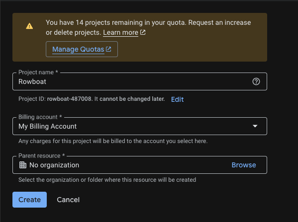
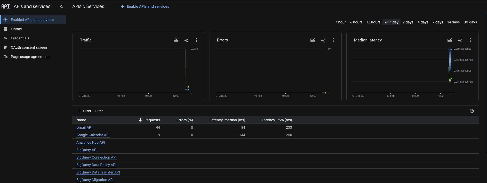
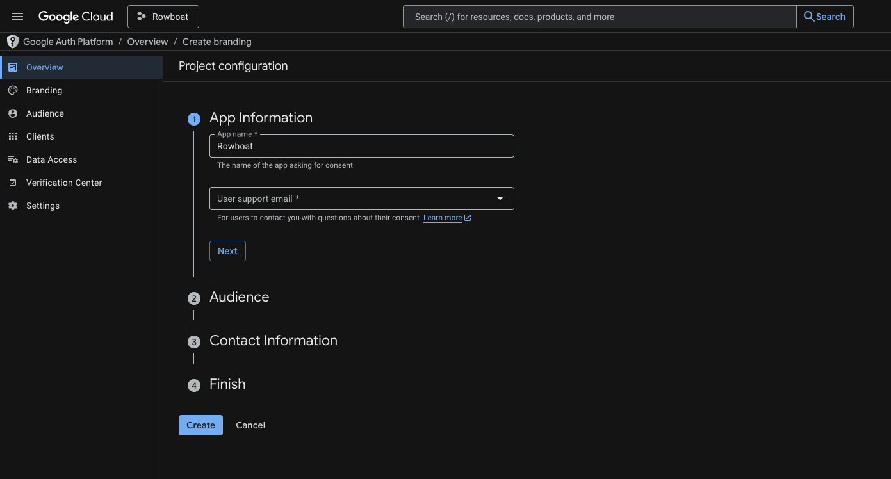
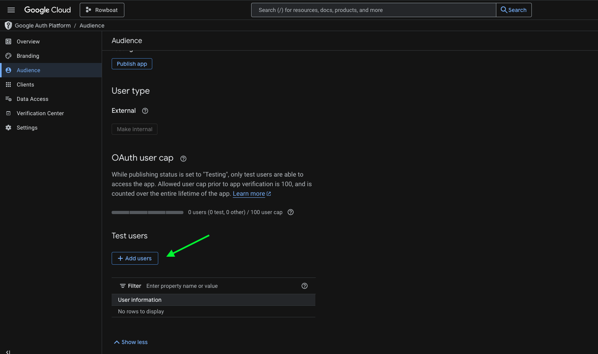
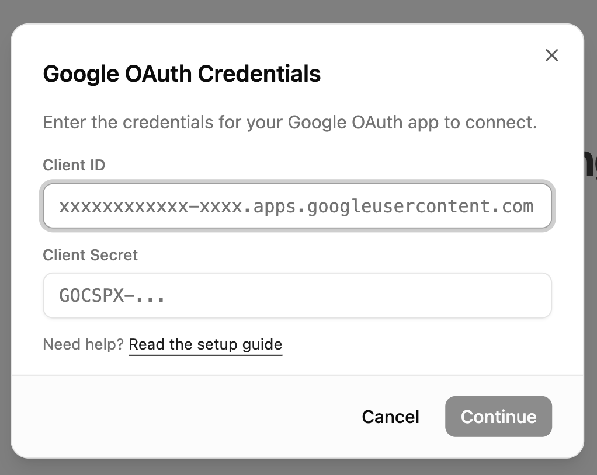

# Connecting Google to Rowboat

Rowboat requires Google OAuth credentials (Client ID and Client Secret) to connect to Gmail, Calendar, and Drive. Follow the steps below to generate them.

---

## 1️⃣ Open Google Cloud Console

Go to:

https://console.cloud.google.com/

Make sure you're logged into the Google account you want to use.

---

## 2️⃣ Create a New Project

Go to:

https://console.cloud.google.com/projectcreate

- Click **Create Project**
- Give it a name (e.g. `Rowboat Integration`)
- Click **Create**

Once created, make sure the new project is selected in the top project dropdown.

---

## 3️⃣ Enable Required APIs

Enable the following APIs for your project:

- Gmail API

    https://console.cloud.google.com/apis/api/gmail.googleapis.com

- Google Calendar API

    https://console.cloud.google.com/apis/api/calendar-json.googleapis.com

- Google Drive API

    https://console.cloud.google.com/apis/api/drive.googleapis.com

For each API:

- Click **Enable**

    

---

## 4️⃣ Configure OAuth Consent Screen

Go to:

https://console.cloud.google.com/auth/branding

### App Information

- App name: (e.g. `Rowboat`)
- User support email: Your email

### Audience

- Choose **External**

### Contact Information

- Add your email address

Click **Save and Continue** through the remaining steps.

You do NOT need to publish the app — keeping it in **Testing** mode is fine.

---

## 5️⃣ Add Test Users

If your app is in Testing mode, you must add users manually.

Go to:

https://console.cloud.google.com/auth/audience

Under **Test Users**:

- Click **Add Users**
- Add the email address you plan to connect with Rowboat

Save changes.

---

## 6️⃣ Create OAuth Client ID

Go to:

https://console.cloud.google.com/auth/clients

Click **Create Credentials → OAuth Client ID**

### Application Type

Select:

**Web application**

- Name it anything (e.g. `Rowboat Desktop`)

### Authorized redirect URIs

Add the following redirect URI:

- `http://localhost:8080/oauth/callback`

Use this exactly: no trailing slash, port **8080**. This must match what the app uses for the OAuth callback.

Click **Create**.

---

## 7️⃣ Copy the Client ID and Client Secret

After creation, Google will show:

- **Client ID**
- **Client Secret**

Copy **both values** and paste them into Rowboat when prompted.

---

## Troubleshooting

**Error after "Authorization Successful"**

If the browser shows "Authorization Successful" but the app then shows an error (e.g. "invalid response encountered" or "response parameter \"iss\" (issuer) missing"):

1. **Check the app logs** (e.g. terminal or dev tools) for the full error. The message there will often indicate the cause (e.g. redirect URI mismatch, missing parameter).
2. **Verify redirect URI in Google Cloud Console**: Open [Credentials → your OAuth 2.0 Client ID](https://console.cloud.google.com/auth/clients). Ensure `http://localhost:8080/oauth/callback` is listed under **Authorized redirect URIs**.
3. **Client type**: Make sure you selected **Web application** as the application type. Other types (Desktop, UWP) may not provide a client secret or may handle redirect URIs differently.

---
